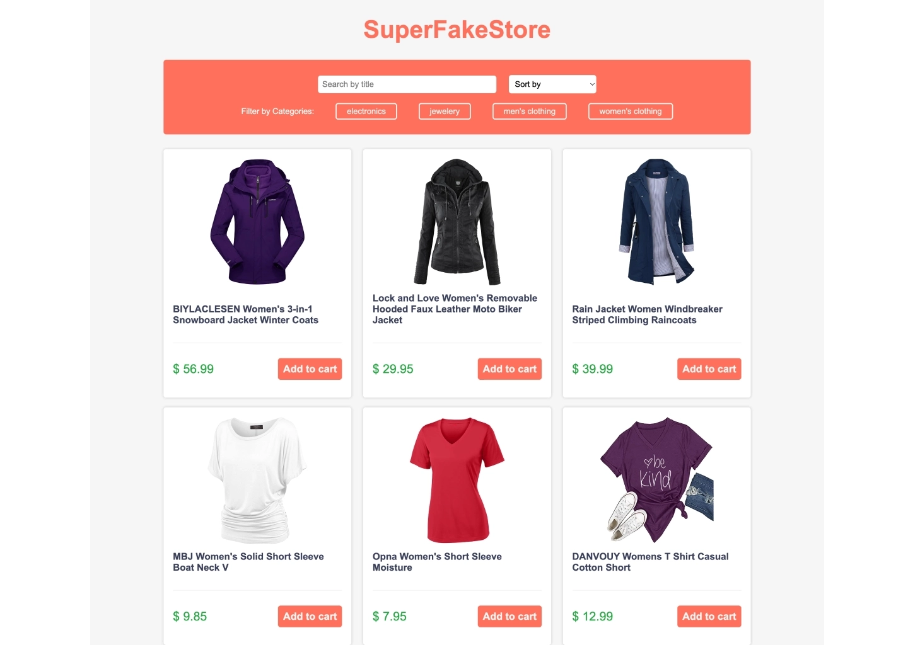

# 🛍️ Project Fakestore API

## **Task**

Build a small e-commerce store using the [FakeStore API](https://fakestoreapi.com/).

---

## **✅ Requirements**

- Use real product data from the FakeStore API.
- Create a clean and visually appealing interface.
- Explore and use the available API endpoints from the official docs:https://fakestoreapi.com/docs

---

## **📦 Suggested Deliverables**

- Product listing page
- Category-based filtering
- Basic search and/or sorting
- Loading and error states

---

## Screenshot

